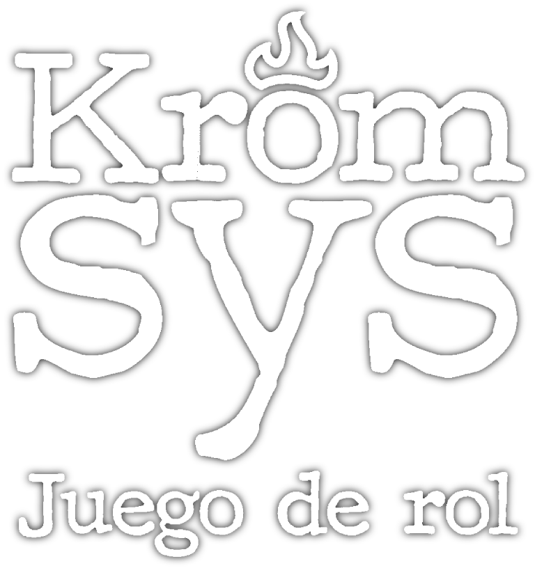

# Kromsys Docs
Hi, this is the repository for the Kromsys documentation.
It uses [Nextra](https://nextra.site/) (a Nextjs + [MDX](https://mdxjs.com/) static site solution)

## Krom-- what?... Come again?
This repository is a NextJS project that gets deployed with a bunch of markdown docs (that you can find [here](https://github.com/sebastianpennino/krom_docs_nextra/pages)). But this repo also contains all the styles, logic, etc so they render properly and look the way I wanted.

(The repo is based on this [Nextra template](https://github.com/shuding/nextra-docs-template) for creating documentation-based sites).

[**Live Site →**](https://kromsys-docs.vercel.app)

## Wait, what is Kromsys?
Kromsys is a free pen and paper RPG, made back in 2011, re-refurbished in 2023 by a old group of friends. If you want to find out more, you will have to visit the live site,

## Local Development
(Or in case you want your own copy of the docs)

First, run `npm i` to install the dependencies.

Then, run `npm dev` to start the development server and visit your [localhost:3000](http://localhost:3000).

