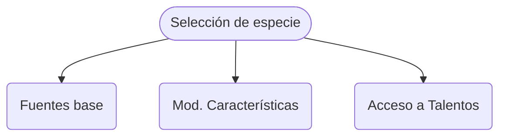
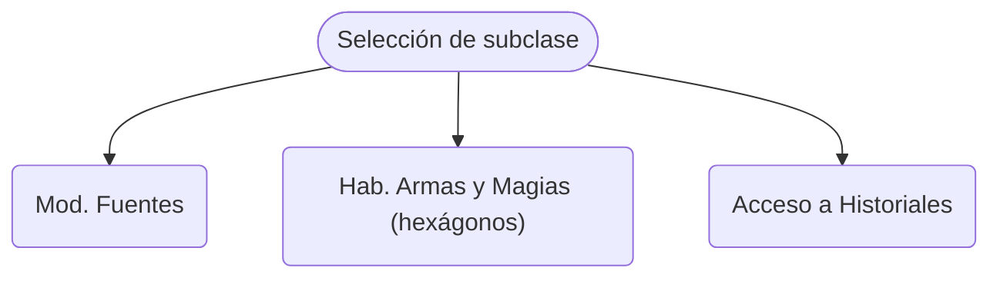

import { Callout } from 'nextra/components'

export function HiddenDiagram({ title, children }) {
  return (
    

      

        <strong className="text-lg">{title}</strong>
      

      
{children}

    

  )
}

# Eligiendo Especie y Subclase

## Elegir una especie

La especie determina toda las características "externas" de un personaje, 
determinan su apariencia, su tipo de vestimenta y cultura/costumbres (arquetípicas, 
tu personaje puede salirse de ellas) y también da un trasfondo simple a la hora 
de ser interpretada. 

A nivel juego otorgan las fuentes base _(vida, mana y adrenalina),_ modifican las
características _(fuerza, resistencia, razonamiento, percepción, etc)_ y, 
dependiendo también de la prioridad que se le haya dado (como veremos más 
adelante en [asignando prioridades](/docs/character-creation/02)) modifican 
el acceso a determinados "poderes" llamados **talentos** (los talentos son 
beneficios de una especie en particular, por ejemplo algunas podrán respirar 
bajo el agua, otras podrán desplazarse más sin descanso, etc)

<HiddenDiagram title="Diagrama de implicancias">

</HiddenDiagram>

Para elegir una especie debes leer la [lista de especies](/docs/list-species). 
Lo ideal es que el director de juego te oriente y tomes una decision basada en 
lo narrativo o el gusto personal (más que en lo numérico). Aquí una pequeña reseña:

### Lista
* [Volkari](/docs/list-species/volkari) - Defensivos, resistentes en combate
* [Orcos](/docs/list-species/orc) - Ofensivos, diestros en el combate
* [Ferales](/docs/list-species/feral) - Rápidos, atléticos, buenos rastreadores
* [Humanos](/docs/list-species/human) - Vérsatiles, aplicados, ideales para cualquier subclase
* [Trenos](/docs/list-species/treno) - Infiltradores, anti-magicos, flexibles
* [Elfos](/docs/list-species/elf) - Magicos, de exteriores, perceptivos
* [Drakkars](/docs/list-species/drakkars) - Muy magicos y sabiondos pero débiles

<Callout type="info">Una vez elegida una especie se anota (de forma definitiva!) 
en la [hoja de personaje](/docs/to-print) donde dice 'especie'.</Callout>

## Elegir una subclase

Las subclasees representan arquetipos de vida. Una subclase es un conjunto de 
decisiones que tu personaje a realizado hasta llegar a su edad actual, todo 
simplificado y con un bonito nombre. Las subclasees se agrupan en categorias, 
llamadas Clases; por ejemplo un Pirata es una subclase de la Clase Rufián, 
así como un Caballero es una subclase de la Clase Guerrero. 

Elegir **la subclase y especie son las desiciones más determinantes de todo el 
juego,** algunas subclases requieren mucho más tiempo de preparación que otras, 
por lo tanto requieren tener más prioridad (como verás más adelante en 
[asignando prioridades](/docs/character-creation/02)) así por ejemplo todas
las subclases de la clase Mago requiere que se le de `prioridad A`; es decir se 
sacrifica la mayor prioridad en aprender a ser mago (realmente requiere esfuerzo
manejar la poderosa magia de `Kromsys`).

<Callout type="info">No hay restricción. Todas las subclases son accesibles por 
cualquiera de las especie.</Callout>

Para elegir una subclase debes leer la [lista de clases](/docs/list-classes). 
A diferencia de otros sistemas, en Kromsys *todas las subclasees son accesibles 
para cualquier especie,* aunque esto deja abierta la posiblidad de combinaciones 
desfavorables (como elegir una especie orientada al combate y tomar una subclase
orientada a la magia), pero como la vida misma, **eso queda a criterio de cada 
jugador.**

A nivel juego la subclase modifica las fuentes (vida, mana y adrenalina) 
establecidas por la especie, dándote 
[las fuentes definitivas](/docs/character-creation/creation-tables/TC3),
también otorgan acceso a diferentes **historiales** (los historiales son cosas que
tu personaje hizo para formarse en su subclase, pueden ser habilidades, mejoras,
compras, o todo tipo de decisiones, cada sublcase tiene una lista propia).

<HiddenDiagram title="Diagrama de implicancias">

</HiddenDiagram>

### Lista
Aquí un pantallazo de cada una:

**Rufianes**
* **[Pirata](/docs/list-classes/ruffian/pirate)** - Ventajoso, mañoso, sucio y diplomático a la vez
* **[Sicario](/docs/list-classes/ruffian/assasin)** - Furtivo, silencioso y despiadado, infiltrador
* **[Ladrón](/docs/list-classes/ruffian/thief)** - Sigiloso, prefiere tomar distancia

**Guerreros**
* **[Duelista](/docs/list-classes/warrior/duelist)** - Especialista en combate individual, curtido
* **[Bárbaro](/docs/list-classes/warrior/barbarian)** - Generalista, brutal, _amante de la lucha_
* **[Caballero](/docs/list-classes/warrior/knight)** - Estudioso del combate, es el _guerrero técnico_

**Monjes**
* **[Marcial](/docs/list-classes/monk/martial)** - Un artista marcial no-magico, maestro de su cuerpo
* **[Sanador](/docs/list-classes/monk/healer)** - Maestro de su espiritu, capaz de curar y luchar a la vez

**Explorador**
* **[Montaraz](/docs/list-classes/explorer/ranger)** - El arquero por excelencia, sobreviviente, de exteriores, rastreador

**Mago-Guerreros**
* **[Paladín](/docs/list-classes/w-mage/paladin)** - Un semi-mago con saberes de escudos que busca proteger y ayudar
* **[Suplicante Oscuro](/docs/list-classes/w-mage/dark-supplicant)** - Un poderoso semi-mago que sacrifica todo para obtener lo que quiere
* **[Cazamagos](/docs/list-classes/w-mage/mage-hunter')** -  Juez y verdugo. Astuto, implacable y valiente

**Shamanes**
* **[Brujo](/docs/list-classes/shaman/witch)** - Astuto, manipulador (y un poco loco), en contacto con las fuerzas oscuras
* **[Clérigo](/docs/list-classes/shaman/cleric)** - Protector, reparador y devoto, en contacto con las fuerzas de la luz
* **[Druida](/docs/list-classes/shaman/druid)** - En contacto con los animales y las fuerzas naturales

**Magos**
* **[Elemental](/docs/list-classes/mage/elemental)** - Estudioso mago de las magias más primogenias
* **[Verde](/docs/list-classes/mage/green)** - Mago de la naturaleza y las fuerzas vitales
* **[Nigromante](/docs/list-classes/mage/necro)** - Mago de la oscuridad y el control de lo inerte
* **[Psíquico](/docs/list-classes/mage/psi)** - Mago de la mente, los engaños y el control
