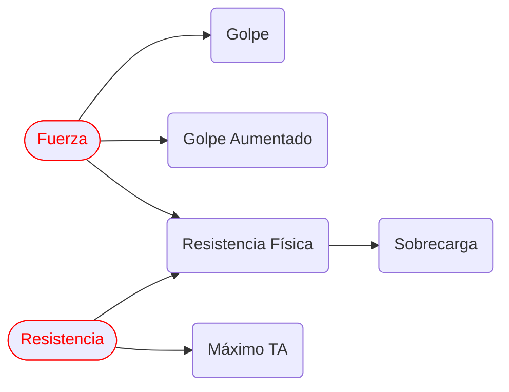
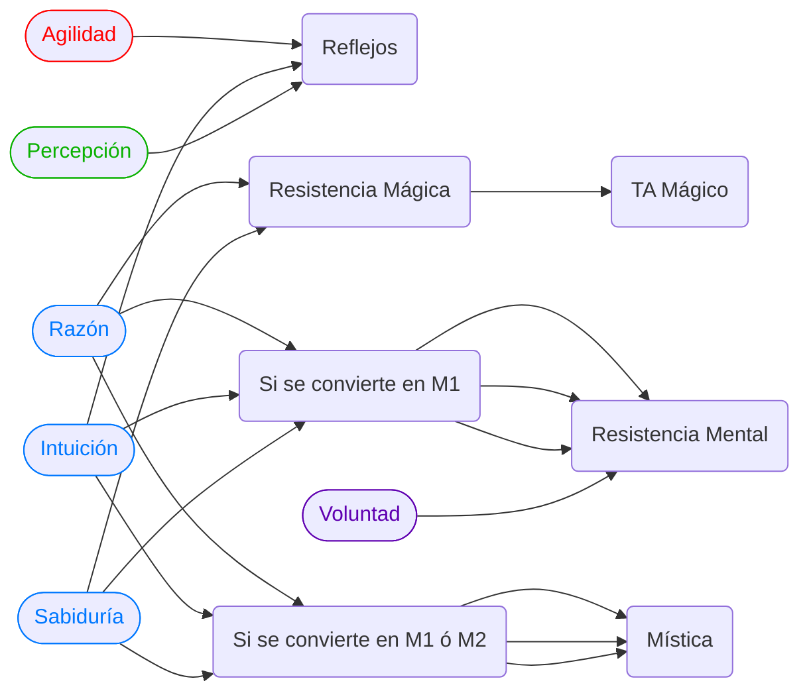

import { Callout } from "nextra/components";

export function HiddenDiagram({ title, children }) {
  return (
    

      

        <strong className="text-lg">{title}</strong>
      

      
{children}

    

  );
}

# Las características

Las caracteristicas definen numéricamente a tu personaje, determinan el valor
de las [derivadas](/docs/character-creation/creation-tables/TC4) y también el
valor inicial de todas tus habilidades. **Son extremadamente influyentes para
el juego.**

Las nueve características en `Kromsys` son:

- **Fuerza:** fuerza bruta del personaje
- **Resistencia:** aguante y desarrollo físico
- **Agilidad:** flexibilidad, reacción
- **Razón:** inteligencia, razonamiento
- **Intuición:** instinto y subconsciente
- **Sabiduría:** capacidad de aprendizaje y retención
- **Social:** carisma, personalidad, sociabilidad
- **Percepción:** sentidos, alerta
- **Voluntad:** fuerza interior, intención y deseo

## Repartiendo las características

- Las caracteristicas se reparten entre valores de **uno a cinco**.
- Luego se aplican los modificadores por especie, **pero debes cuidar que
  ninguna quede en cero.**

<Callout type="info">
  {" "}
  Esto significa que aquellas especies que tienen un `(-1)` en su modificador, efectivamente
  deben tener repartido un "2" como mínimo para que `2 - 1 = 1` y así no quede en
  cero esa característica!
</Callout>

- Como el máximo posible **a repartir es cinco,** la única forma de obtener un seis
  es con un bono de la especie elegida.
- Si elegiste `prioridad C o D`, recuerda el limite de las que puedes dejar en cinco.
- La suma total de los puntos repartidos debe coincidir con el máximo permitido
  por la categoría asignada (cuando se asignaron prioridades).

| Prioridad |       Reparte puntos y limitaciones       |
| :-------: | :---------------------------------------: |
|     A     |             Reparte 32 puntos             |
|     B     |             Reparte 28 puntos             |
|     C     |   Reparte 25 puntos - solo dos en cinco   |
|     D     |   Reparte 22 puntos - solo una en cinco   |
|     E     | Reparte 20 puntos - **Ninguna en cinco!** |

- En el caso de la `prioridad E` no se puede dejar ninguna en cinco (reparte de 1 a 4).

<Callout type="info" emoji="✏️">
  {" "}
  Una vez repartidas en la **hoja de personaje** las características, podemos pasar a
  la [siguiente sección](/docs/character-creation/04).
</Callout>

## Influencias de cada característica

Cada característica influencia en el valor inicial de las habilidades (puedes
ver el detalle en la [lista de habilidades](/docs/list-skills/individual)),
pero más allá de eso, aquí un pequeño mapa mental para entender la influencia de
cada una de las caracteristicas en las `derivadas`:

<HiddenDiagram title="Diagrama de implicancias">

</HiddenDiagram>
