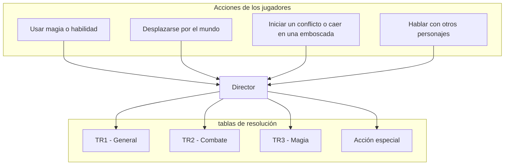

import { Callout } from "nextra/components";

# Desglose del sistema

<Callout type="error" emoji="⚠️">
  Esta sección aun esta en proceso de creación y tiene muy baja prioridad.
  Probablemente sea lo ultimo que completemos.
</Callout>

## Fislosofía de diseño

- "Take that Director" a proposito
- Poco numero, poca tirada
- Gamey a proposito
- Evitando "trampas" de diseño
- One dice to rule them all

### Los personajes jugadores y la hoja de personaje

- Armar un personaje debe ser divertido
- Armar un personaje debe ser poderoso

#### Pocos valores, numeros chicos

- Caracteristicas 1 a 6, siendo 6 solo si tenes bono
- Resistencias
- Derivadas

#### Creación con prioridades: la incomodidad del balance

- El equilibrio inestable

##### Talentos e historiales: la sábana corta

- Como provocar el replay value
- Como lo unico es sabroso

## Entorno narrativo y tactico

- Switch de precision (necesidad)
- El juego dentro del juego

### Pocas tablas, poco texto

- Menos tablas, poco texto
- Cortito y al pie

## Sistema de combate

- Tactico y sabroso
- La replica como medio de expresión
- Magia que daña Poco

## Sistema de magia espontánea

- La libertad dentro de los limites de tu imaginacion
- El defecto de la magia narrativa a la vista
- Las ventajas sobrepasan los defectos

## Sistema de progresión

- Como mejorar lo que usaste
- Como se retira un personaje
