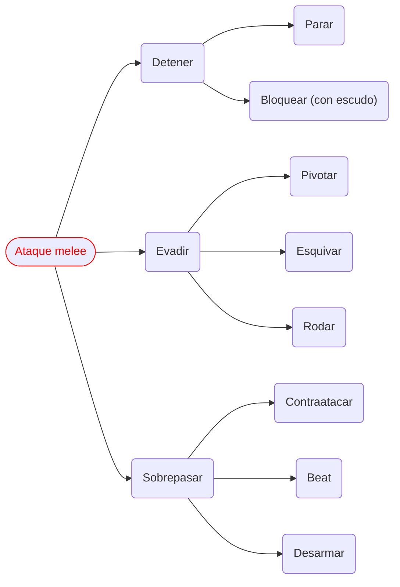
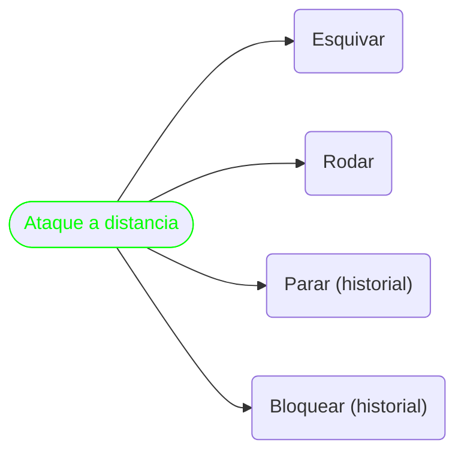
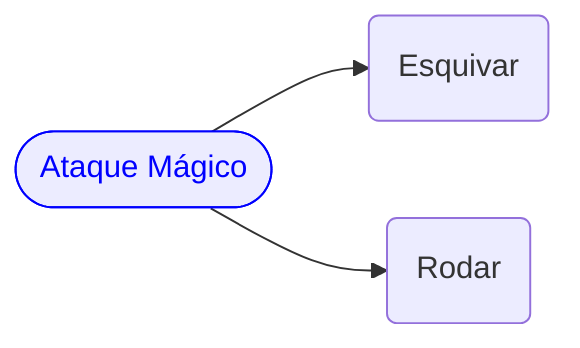

export function HiddenDiagram({ title, children }) {
  return (
    

      

        <strong className="text-lg">{title}</strong>
      

      
{children}

    

  )
}

# 3. Acciones comunes [#3-0]

La siguiente es una lista de acciones posibles dentro de un asalto. Para hacerlas:

- Se debe poder pagar el total de la acción para realizarla (no se puede pagar en cuotas)
- Solo se puede reaccionar a acciones que afectan de forma directa ([como describe 1.3.1](/docs/ruling-combat/01#1-3-1))
- Por defecto todas las acciones que requieren PA se pagan inmediatamente al declararlas ([1.3.1](/docs/ruling-combat/01#1-3-1)) y las que consumen PR en cambio se declaran, pero se pagan en el momento de resolución ([1.3.2](/docs/ruling-combat/01#1-3-2))

## 3.1 Desplazarse o pasar (1 PA) [#3-1]

Moverse hasta 3 metros (1 casilla) en una dirección (o simplemente quedarse quieto y “pasar”). Si te desplazas estando en rango de un enemigo al comienzo del movimiento, este enemigo tendrá un ataque de oportunidad gratis ([ver 4.9](/docs/ruling-combat/04#4-9)).

## 3.2 Levantarse o tirarse al piso (1 PA) [#3-2]

Estando en el suelo (tirado) se levanta o viceversa. Solo si te levantas estando en rango de un enemigo, este enemigo tendrá un ataque de oportunidad gratis ([ver 4.9](/docs/ruling-combat/04#4-9)). En caso de múltiples enemigos, solo habrá un único ataque de oportunidad (es decir, uno en total, sin importar la cantidad de enemigos) por intento de levantarse.

## 3.3 Beber poción / untar aceite en arma (1 PA) [#3-3]

Consumes una poción o colocas un aceite sobre un arma (las pociones recuperan puntos de alguna fuente, los aceites alteran las armas temporalmente)

## 3.4 Desenvainar o envainar (1 PA o 1 PR) [#3-4]

Consiste en revelar o guardar hasta dos armas que se tenían a mano (por ejemplo en la mochila, o en las vainas). Nota: se puede usar la habilidad desenvaine rápido para intentar revelar o guardar armas sin gastar el punto táctico

## 3.5 Buscar y levantar arma en cercanías / o tirar arma (1 PA) [#3-5]

Se busca un arma que está tirada en el suelo en un radio de 3 mts (casilla actual o adyacente) (recuperarla cuenta cómo envainar), o se lanza/deja caer un arma en la misma distancia.

## 3.6 Charge con derribo (CD) (maniobra ofensiva) (2 PA) [#3-6]

- Costo: 2 PA (durante turno activo)
- Requisitos: Estar adyacente o a una casilla del oponente
- Descripción: El objetivo es llevar al oponente al suelo, ya que un oponente en el suelo tiene desventaja (ver [2.2 posición privilegiada](/docs/ruling-combat/02#2-2)). Moverse una casilla es parte de la acción (pero también se puede hacer adyacente).
- Réplicas posibles: Esquivar ([ver 5.4](/docs/ruling-combat/05#5-4))
- Resolución: Usando `física` con `VE6`. La única réplica posible es esquivar ([ver 5.4](/docs/ruling-combat/05#5-4)). Si no hay réplica (porque el defensor no tiene puntos o decide no hacerlo), se realiza una contienda simple entre la `física` del agresor y la `física` del defensor (en caso de empate gana el defensor).
- Si tiene éxito: El agresor se desplaza hasta estar adyacente al oponente, y el oponente queda tirado en el suelo.
- Si es esquivado: No hay desplazamiento.
- Si es resistido: El agresor se desplaza pero no consigue derribar al oponente.
- Si falla: No hay desplazamiento ni derribo.
- Si pifia: No hay desplazamiento. El agresor tropieza y cae al suelo.

## 3.7 Bash (maniobra ofensiva) (1 PA) [#3-7]

- Costo: 1 PA (durante turno activo)
- Requisitos: Portar escudo y habilidad de escudos acorde
- Descripción: El escudo se utiliza de forma ofensiva mediante un movimiento muy corto y veloz, con la posibilidad de causar críticos especiales. El objetivo es colocar un efecto sobre el oponente más que infligir daño directo.
- Réplicas posibles: Pivotar ([ver 5.3](/docs/ruling-combat/05#5-3)), Esquivar ([ver 5.4](/docs/ruling-combat/05#5-4))
- Resolución: Usando "habilidad de escudo" con VE según la calidad del escudo.
- Fórmula de daño: `TA del escudo` + `éxitos obtenidos`. 
> Por ejemplo, si el TA del escudo es 3 y se obtienen 2 éxitos en la tirada de habilidad de escudo, el resultado final sería de 5 (3 + 2).
- Críticos: Bash usa los siguientes críticos: [0] sorpresa -> le saca un punto de reacción, [00] paralizar -> actual y próximo asalto pierde todos los puntos tácticos (PA y PR)
- Si tiene éxito: Sucede el bash
- Si falla: No sucede nada
- Si pifia: Standard (ver [7.0 Pifias](/docs/ruling-combat/07)(/docs/ruling-combat/07))

## 3.8.A Ataque melee [#3-8-A]

- Armas de una mano (1 PA): realizas un ataque común ([ver 4.1](/docs/ruling-combat/04#4-1))
- Armas a dos manos (2 PA): realizas un ataque a dos manos ([ver 4.2](/docs/ruling-combat/04#4-2))
- Artes marciales (1 PA): realizas un ataque usando artes marciales ([ver 4.3](/docs/ruling-combat/04#4-3))
- Artes con mano descubierta (1 PA): realizas un ataque usando tus manos ([ver 4.4](/docs/ruling-combat/04#4-4))
- Dual attack (requiere doble arma, ambidiestro) (1 PA + 1 PA en resolución): intentas realizar un ataque doble con dos armas (cuesta 1 PA en declaración y si fue exitoso un 1 PA adicional en resolución) ([ver 4.5](/docs/ruling-combat/04#4-5))

## 3.8.B Respuestas a ataque melee [#3-8-B]

- Contraatacar (1 PR) ([ver 5.1](/docs/ruling-combat/05#5-1))
- Parar (arma / artes marciales) (1 PR) ([ver 5.2](/docs/ruling-combat/05#5-2))
- Pivotar (1 PR) ([ver 5.3](/docs/ruling-combat/05#5-3))
- Esquivar (2 PR) ([ver 5.4](/docs/ruling-combat/05#5-4))
- Rodar (1 PR y 1 PA) ([ver 5.5](/docs/ruling-combat/05#5-5))
- Bloquear (requiere escudo) (1 PR) ([ver 5.6](/docs/ruling-combat/05#5-6))
- Beat (1 PR) ([ver 5.7](/docs/ruling-combat/05#5-7))
- Desarmar (requiere habilidad y manos libres / artes marciales) (1 PR) ([ver 5.8](/docs/ruling-combat/05#5-8))

<HiddenDiagram title="Respuestas a Ataque melee">

</HiddenDiagram>

## 3.9 Cargar Ballesta (2 PA) [#3-9]

Cargar la ballesta con un proyectil (es considerablemente más lento que un arco).

## 3.10 Apuntar y disparar ballesta (1 PA) [#3-10]

Apuntas y realizas un ataque de arma a distancia con ballesta ([ver 4.6](/docs/ruling-combat/04#4-6))

## 3.11 Cargar, apuntar y disparar con arco (2 PA) [#3-11]

Cargas, apuntas y realizas un ataque de arma a distancia con arco ([ver 4.6](/docs/ruling-combat/04#4-6))

## 3.12 Respuestas a ataque de arma a distancia (arco y ballesta) [#3-12]

- Parar (requiere historial “parar proyectil”) (1 PR) ([ver 5.2](/docs/ruling-combat/05#5-2))
- Esquivar (2 PR) ([ver 5.4](/docs/ruling-combat/05#5-4))
- Rodar (1 PR y 1 PA) ([ver 5.5](/docs/ruling-combat/05#5-5))
- Bloquear (requiere escudo) (1 PR) ([ver 5.6](/docs/ruling-combat/05#5-6)) (24/08/23 solo accesible por historial - Paladín)

<HiddenDiagram title="Respuestas a Ataque a distancia">

</HiddenDiagram>

## 3.13.A Ataque mágico (2 PA) [#3-13-A]
 
Realizas un ataque mágico ([ver 4.8](/docs/ruling-combat/04#4-8))

## 3.13.B Respuestas a ataque mágico [#3-13-B]

- Esquivar (2 PR) ([ver 5.4](/docs/ruling-combat/05#5-4))
- Rodar (1 PR y 1 PA) ([ver 5.5](/docs/ruling-combat/05#5-5))

<HiddenDiagram title="Respuestas a Ataque Mágico">

</HiddenDiagram>

## 3.14 Usar habilidad / Maniobras dinámicas (2 PA) [#3-14]

1. El personaje le describe al director su intención, se determina si tiene alguna habilidad relacionada o no y si esta es adrenal o no (las acciones adrenales permiten el consumo de adrenalina para obtener dados). 
2. El director utiliza la tabla de resolución general (ver TR1) para establecer la cantidad de éxitos requeridos y una dificultad (que determina el valor de éxito), se ajusta la descripción hasta que el personaje y el director estén conformes. 
3. Una vez que están de acuerdo, se tiran tantos dados como tenga en la habilidad (si no tiene ninguna, siempre se tiran 1d10) y si es adrenal, se podrán comprar tantos dados como tenga en dicha habilidad (obteniendo un dado por cada 10 de adrenalina) (30/03/23: pero siempre es posible comprar 30 de adrenalina mínimo!).
4. Utilizando la TR1 se determina si la acción fue un éxito o no. Importante: dentro del combate una dinámica nunca podrá producir un movimiento mayor a 5 casillas. Algunas habilidades están regladas dentro del combate (Ej: Esprintar reglado dentro del combate: mover 3 casillas VE6 (min) / 4 → VE7 / 5 → VE8).

## 3.15 Lanzar hechizo narrativo (2 PA) [#3-15]

1. El personaje le describe al director que hexágono utilizará y la intención de su hechizo. 
2. El director utiliza la tabla 3 de resolución de magias para fijar un precio y le devuelve al personaje el número final de dicha tasación (por ejemplo: 3 éxitos VE 5) (sin revelar cómo logró tasarlo!), 
3. Sucede entonces una negociación entre el personaje y el director hasta llegar a un precio que ambos estén de acuerdo. 
4. Si el personaje decide proceder podrá comprar dados de mana pagando el costo usual (10 de mana para obtener un dado, nunca pudiendo comprar más dados que los que tenga en su hexágono, es decir por ejemplo teniendo 3 dados en Fuego, solo podrá comprar otros 3 dados adicionales, lanzando 6d10 en total).

